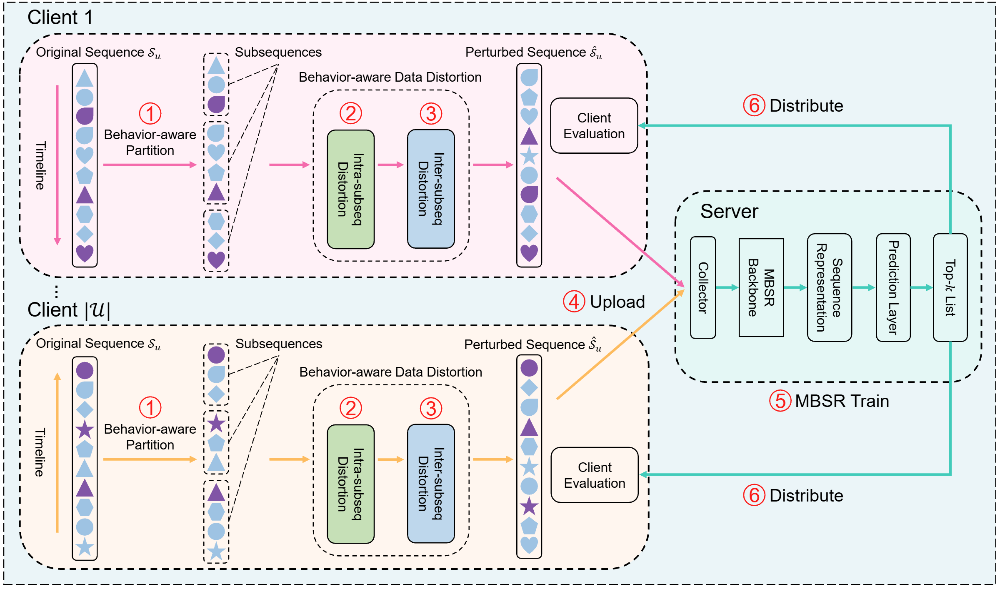

# BAPP

> [**A General Behavior-Aware Privacy-Preserving Framework for Sequential Recommendation**]()               
> Yudi Xiong, Weike Pan, Qiang Yang, Zhong Ming
> 

[](https://scholar.google.com/citations?user=LY4PK9EAAAAJ) | [](https://orcid.org/0009-0001-3005-8225)


## BAPP Architecture



Fig. 1. The framework of our BAPP. The timeline indicates the temporal order of the interaction sequence, where interactions closer to the arrowhead correspond to more recent user activities. Different shapes denote different items. Purple items indicate purchase behaviors, while blue items indicate auxiliary behaviors.


## Introduction

Multi-behavior sequential recommendation (MBSR) has achieved significant success by modeling the time-evolving heterogeneous behavioral dependencies, thereby better learning users’ multifaceted intentions. However, in recent years, user privacy has become an increasingly critical concern. Existing privacy-preserving methods in recommendation systems often introduce excessive interference or noise, which leads to performance degradation. To tackle this challenge, we propose a novel general framework called behavior-aware privacy-preserving (BAPP) for MBSR. To the best of our knowledge, we are the first to introduce a privacy-preserving framework specifically designed to provide privacy protection while maintaining strong recommendation performance in the MBSR setting. Specifically, we define a new notion of constrained sequential differential privacy that protects the item IDs and the order information of non-final interactions, and design behavior-aware privacy-preserving operations to construct rich and privacy-preserving training samples. We then provide a randomized algorithm satisfying this differential privacy and establish its theoretical proof. In addition, we integrate a position-based sampling scheme into inter-subsequence distortion, which effectively mitigates the data perturbation caused by privacy-preserving operations. Overall, by leveraging intra- and inter-subsequence distortions, our BAPP reduces the direct exposure of users’ raw multi-behavior interaction sequences and, at the same time, maintains strong recommendation performance benefiting from the enhanced data diversity. Note that our BAPP is a data-oriented and non-intrusive method that can be directly integrated into any downstream MBSR models without modification. We conduct experiments on three real-world datasets, and the results demonstrate the effectiveness of our BAPP and its applicability to a wide variety of mainstream MBSR models.  If you find this repository useful to your research or work, it is really appreciate to **star** this repository. :heart:


## License

Our code is licensed under the [MIT License](LICENSE).

All open-sourced is for research purpose only.

## Citation

If you find our code or paper useful for your research, please cite paper with the following BibTeX entry. Thank you!
```

```

## Acknowledgement

We thank the support of National Natural Science Foundation of China (Nos. 62461160311, 62272315, and 62672332), Scientific Research Capacity Enhancement Program for Key Construction Disciplines in Guangdong Province (No. 2024ZDJS063), and National Key Research and Development Program of China (No. 2023YFF0725100).

## Contact

- Email: xiongyudi2023 at email dot szu dot edu dot cn
